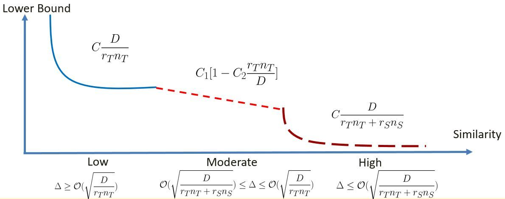
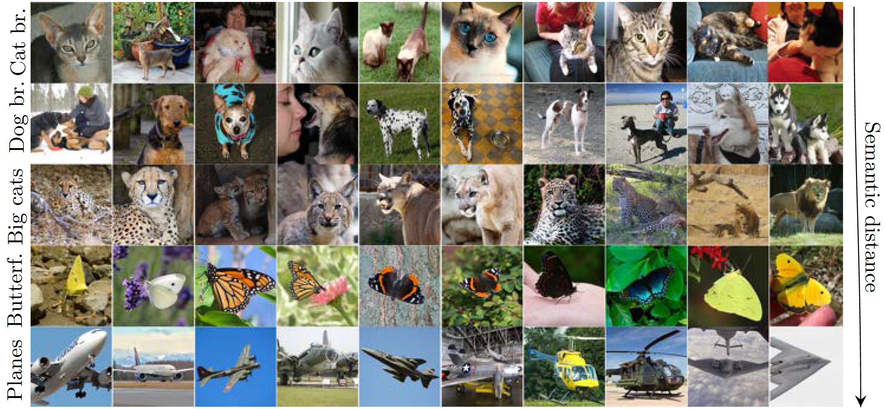

# Minimax Lower Bounds for Transfer Learning with Linear and One-hidden Layer Neural Networks
arXiv version: https://arxiv.org/abs/2006.10581

NeurIPS 2020 paper: coming soon



# Installation
To download the repository and its submodules and install all necessary dependencies, create a new virtual environment and run
````
git clone --recurse-submodules https://github.com/z-fabian/TransferLowerbounds.git
cd TransferLowerbounds
pip install -r requirements.txt
````

# Downloading the datasets
Before running the Jupyter Notebook, you need to download the datasets used in the experiments. We sampled 5 datasets consisting of various classes from ImageNet. We use [ImageNet-datasets-downloader](https://github.com/mf1024/ImageNet-datasets-downloader) to scrape the necessary number of images for each class. To download the images and extract the features used in this paper, set **$DATASETS_DIR** to the folder the images should be saved and run
````
python create_datasets.py --data-dir $DATASETS_DIR --from-file premade_datasets.txt --download-images
````
Note, that the downloaded images depend on the availability of URLs at the time of running the above code, and therefore it is not guaranteed that the exact same images will be downloaded as used in the paper.

Alternatively, the exact datasets used in the paper can be downloaded from this [link](https://drive.google.com/file/d/1SprV04o-ih7yu-y6Mt4ieKUD5BZW3keS/view?usp=sharing).

# Reproducing the results
To reproduce the results as seen in Table 1 and Figure 1 in the paper we recommend downloading the datasets from the provided link. If you choose to use the downloader tool to create the datasets, small variations in numerical values is possible depending on the availability if ImageNet URLs.

After the dependencies have been installed and the datasets downloaded, please run `numerical_results.ipynb` to obtain the results from the paper.
